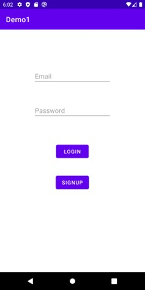
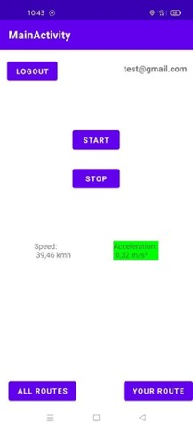
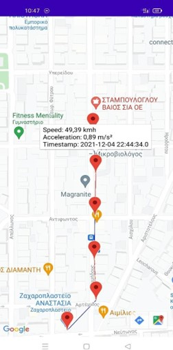
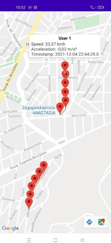

# Accelerometer
A demo Android app for capturing accelerations and decelerations of a moving vehicle.

## Description
The purpose of this project is to make an Android app where users sign up or log in to their account and have the ability to record the movement of the vehicle they are in.

Overall, the application supports the following functionalities:
  - Start and finish of the capturing of acceleration and braking events.
  - Details about the speed and the acceleration are shown live.
  - A map that contains all the routes made by the users of the app, or the route that the current user made.
  - The routes on the map contain pinpoints that display information about the speed, acceleration and the timestamp of that momment, when the user presses on them.
  - The lines connecting the points on the map obtain a colour of blue if an acceleration was captured between first and the last point and red if there was a deceleration.
  
## Technologies used
 - Android Studio 
 - Firebase 

## Screenshots
  Login page            |       Main menu           | Routes and details displayed on map  |  All users routes
:----------------------:|:-------------------------:|:------------------------------------:|:------------------------------------:
  |   |  | 
  
